## UML

经典的UML关系图
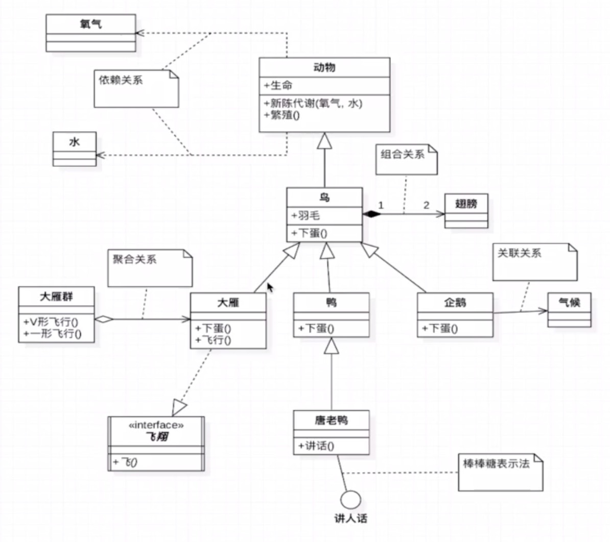

## 软件设计的七大原则

### 开闭原则
最重要的原则，其他原则的基础；面向抽象编程

* 定义：一个软件实体如类、模块和函数应该对扩展开放，对修改关闭
* 用抽象定义框架，用实现扩展细节
* 优点：提高软件系统的可复用性及可维护性

### 依赖倒置原则

* 定义：高层模块不应该依赖低层模块，二者都应该依赖其抽象
* 抽象不应该依赖细节；细节应该依赖抽象
* 针对接口编程；不要针对实现编程
* 优点：可以减少类间的耦合性、提高系统稳定性，提高代码可读性和可维护性，可降低修改程序所造成的风险
  
 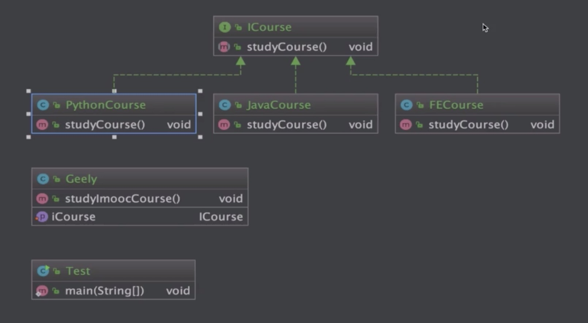 

### 单一职责原则

* 定义：不要存在多于一个导致类变更的原因
* 一个类/接口/方法只负责一项职责
* 优点：降低类的复杂度、提高类的可读性，提高系统的可维护性、降低变更引起的风险。

### 接口隔离原则

* 定义：用多个专门的接口，而不使用单一的总接口，客户端不应该依赖它不需要的接口
* 一个类对一个类的依赖应该建立在最小的接口上
* 建立单一接口，不要建立庞大臃肿的接口
* 尽量细化接口，接口中的方法尽量少
* 注意适度原则，一定要适度
* 优点：符合常说的高内聚低耦合的设计思想，从而使的类有很好的可读性、可扩展性和可维护性

### 迪米特法则（最少知道原则）

* 定义：一个对象应该对其他对象保持最少的了解。又叫最少知道原则
* 尽量降低类与类之间的耦合
* 优点：降低类之间的耦合
* 强调只和朋友交流，不和陌生人说话
* 朋友：出现在成员变量、方法的输入、输出参数中的类称为成员朋友类，而出现在方法体内部的类不属于朋友类

### 里氏替换原则

* 引申意义：子类可以扩展父类的功能，但不能改变父类原有的功能。
* 含义1：子类可以实现父类的抽象方法，但不能覆盖父类的非抽象方法。
* 含义2：子类中可以增加自己特有的方法。
* 含义3：当子类的方法重载父类的方法时，方法的前置条件（即方法的输入/入参）要比父类方法的输入参数更宽松。
* 含义4：当子类的方法实现父类的方法时（重写/重载或实现抽象方法），方法的后置条件（即方法的输出/返回值）要比父类更严格或相等。
* 优点1：约束继承泛滥，开闭原则的一种体现。
* 优点2：加强程序的健壮性，同时变更时也可以做到非常好的兼容性，提高程序的维护性、可扩展性。降低需求变更时引入的风险。

### 合成/复用原则（组合/复用原则）

* 定义：尽量使用对象组合/聚合，而不是继承关系达到软件复用的目的。
* 聚合has-A和组合contains-A。
* 优点：可以使系统更加灵活，降低类与类之间的耦合度，一个类的变化对其他类造成的影响相对较小。

## 设计模式

### 简单工厂模式（simplefactory）
难度系数：1星

* 定义：由一个工厂对象决定创建出哪一种产品类的实例
* 类型：创建型，但不属于23种设计模式
* 使用场景：
  * 工厂类负责创建的类比较少
  * 应用层只知道传入工厂类的参数，对于如何创建对象（逻辑）不关心
* 优点：
  * 只需要传入一个正确的参数，就可以获取你所需要的对象，而无需知道其创建细节
* 缺点：
  * 工厂类的职责相对过重，增加新的产品需要修改工厂类的判断逻辑，违背开闭原则
* UML
  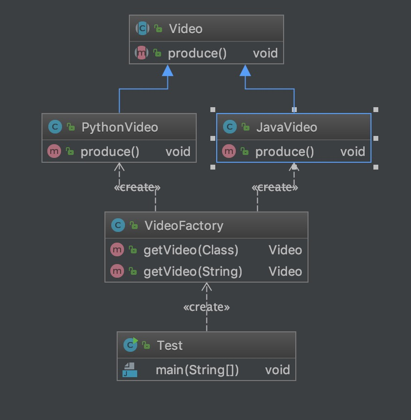

### 工厂方法模式（factorymethod）
难度系数：3星

* 定义：定义一个创建对象的接口，但让实现这个接口的类来决定实例化哪个类，工厂方法让类的实例化推迟到子类中进行。
* 类型：创建型
* 适用场景：
  * 创建对象需要大量的重复代码。
  * 应用层代码不依赖产品类实例如何被创建、实现等细节。
  * 一个类通过其子类来指定创建哪个对象。
* 优点：
  * 用户只需要关心所需穿品对应的工厂，无须关心创建细节
  * 加入新产品符合开闭原则，提高可扩展性
* 缺点：
  * 类的个数容易过多，增加复杂度
  * 增加了系统的抽象性和理解难度
* UML
  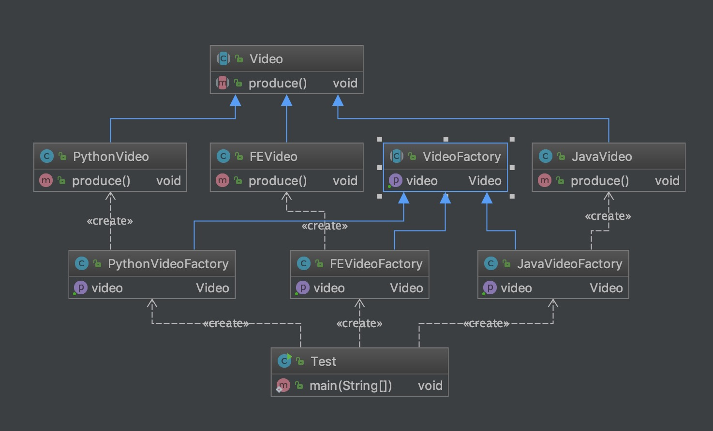

### 抽象工厂模式（abstractfactory）
难度系数：3星

* 定义：抽象工厂模式提供一个创建一系列相关或相互依赖对象的接口
* 无需指定它们具体的类
* 类型：创建型
* 适用场景：
  * 应用层不依赖于产品类实例如何被创建、实现等细节
  * 强调一系列相关的产品对象（属于同一产品族）一起使用创建对象需要大量重复的代码
  * 提供一个产品类的库，所有的产品以同样的接口出现，从而使客户端不依赖于具体实现
* 优点：
  * 具体产品在应用层代码隔离，无须关心创建细节
  * 将一个系列的产品族统一到一起创建
* 缺点：
  * 规定了所有可能被创建的产品集合，产品族中扩展新的产品困难，需要修改抽象工厂的接口
  * 增加了系统的抽象性和理解难度
* 产品等级结构和产品族
  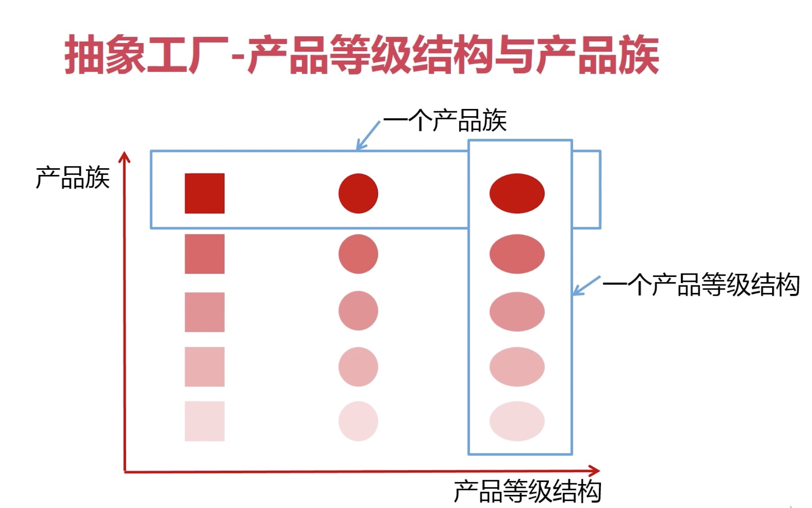
  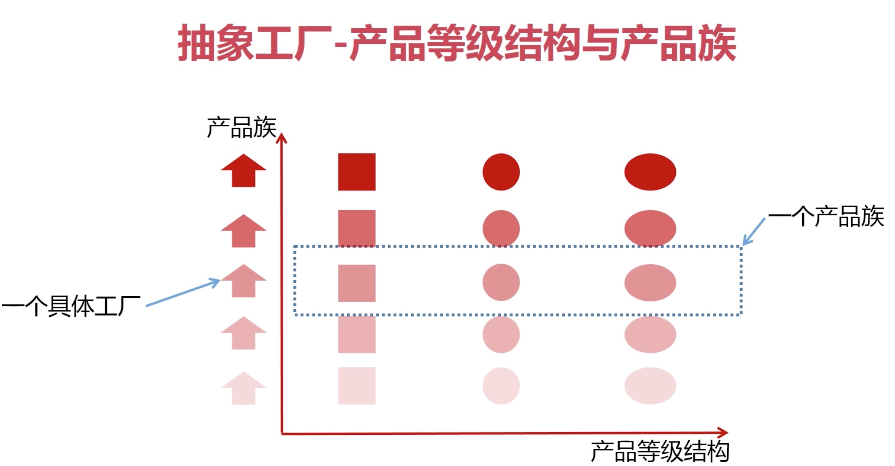
* UML
  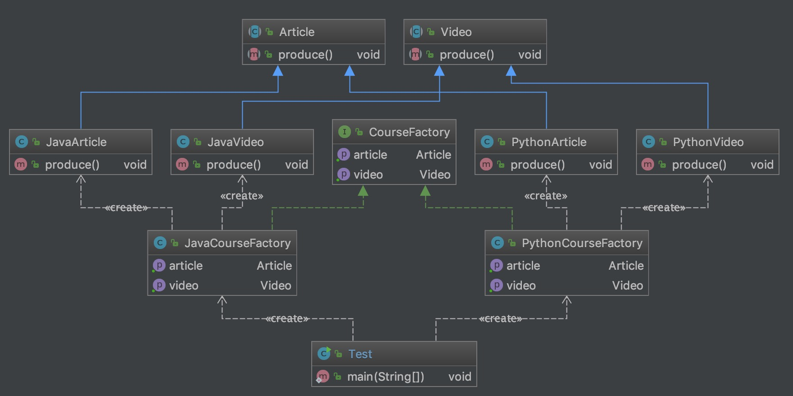

总结：抽象工厂的方法经常以工厂方法里的方式来实现，只不过**工厂方法关注产品等级结构,抽象工厂关注产品族**;这两个关注点是两个设计模式最大的区别。

### 建造者模式（builder）
难度系数：2星

* 定义：将一个复杂对象的构建与它的表示分离，使得同样的构建过程可以创建不同的表示
* 用户只需要指定需要构建的类型就可以得到它们，构建过程及细节不需要知道
* 类型：创建型
* 使用场景：
  * 如果一个对象有非常复杂的内部结构（很多属性）
  * 想把复杂对象的创建和使用分离
* 优点：
  * 封装性好，创建和使用分离
  * 扩展性好、建造类之间独立、一定程度上解耦
* 缺点：
  * 产生多余的Builder对象
  * 产品内部发生变化，建造者都需要修改，成本较大
* 和工厂模式的区别：
  * 建造者模式更注重方法的调用顺序；工厂模式更注重于创建产品
  * 创建对象的力度不同：创造者模式可以创建一些复杂产品，由各种复杂的部件组成；工厂模式创建的都一样
  * 关注点不同：工厂模式注重把产品（对象）创建出来；创造者模式不但注重于创建产品，而且还需要知道产品都是由哪个部件组成的，譬如创建的顺序。
* 源码示例：
  * JDK: StringBuilder
  * Guava: ImmutableSet
  * Spring: BeanDefinitionBuilder
  * Mybatis: SqlSessionFactoryBuilder
* UML
  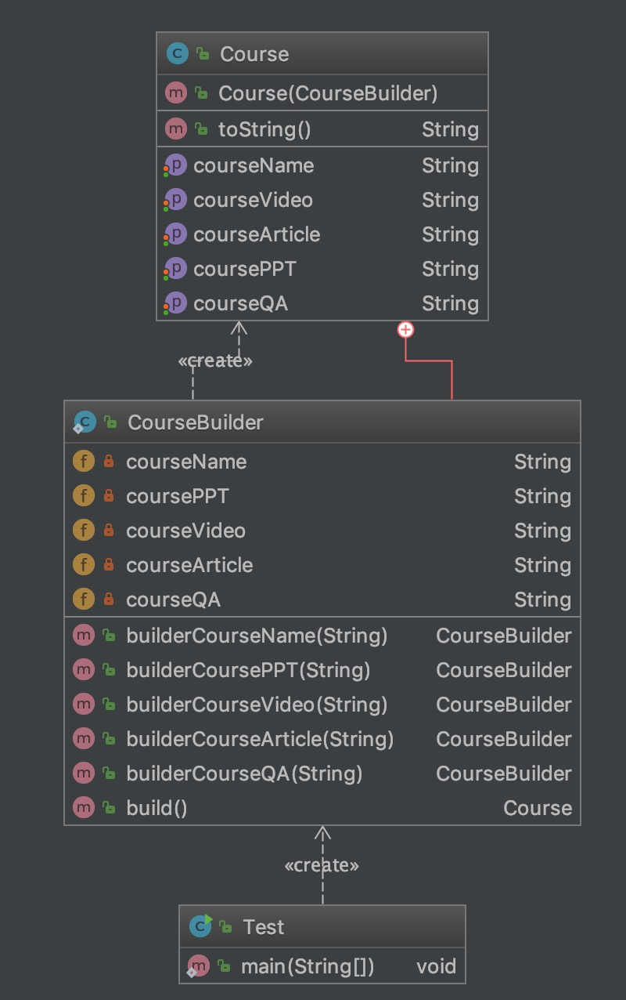

### 单例模式（singleton）
难度系数：5星

* 定义：保证一个类仅有一个实例，并提供一个全局访问点
* 类型：创建型
* 适用场景：
  * 想确保任何情况下都绝对只有一个实例
* 优点：
  * 在内存里只有一个实例，减少内存开销
  * 可以避免对资源的多重占用
  * 设置全局访问点，严格控制访问
* 缺点：
  * 没有接口，扩展困难
* 重点：
  * 私有构造器
  * 线程安全
  * 延迟加载
  * 序列化和反序列化安全
  * 反射
* 实用技能
  * 反编译
  * 内存原理
  * 多线程DEBUG
* 单例模式相关的设计模式
  * 单例模式和工厂模式：工厂类为单例模式
  * 单例模式和享元模式
* 种类：
  * 懒汉模式
    1. 在getInstance方法上加synchronized同步锁
    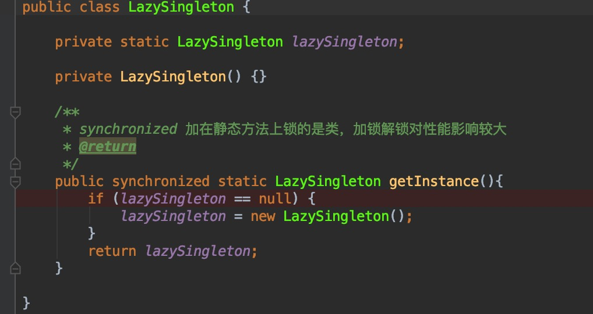
    2. 基于double check双重检查的对象初始化延迟加载
    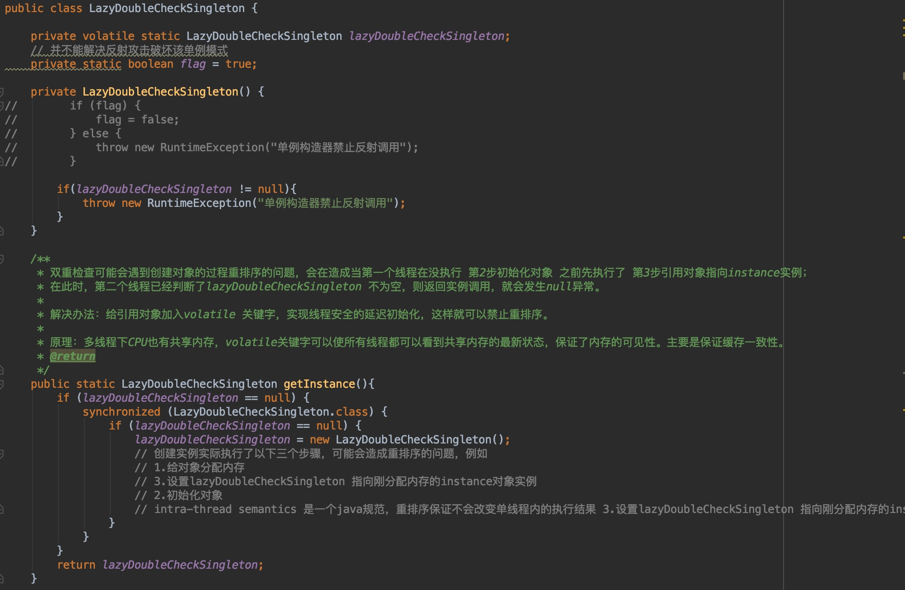
    3. 基于静态内部类初始化的延迟加载
    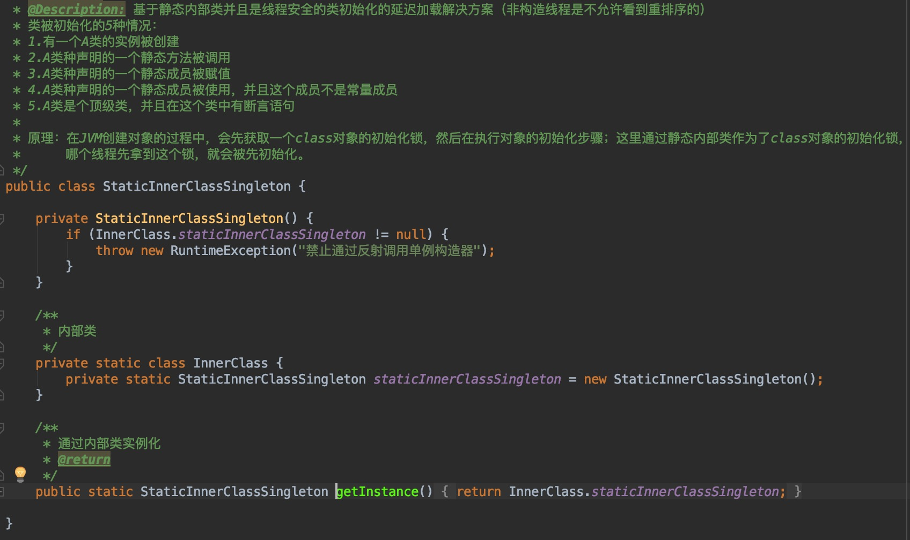
  * 恶汉模式
    1. 基于静态化常量属性
    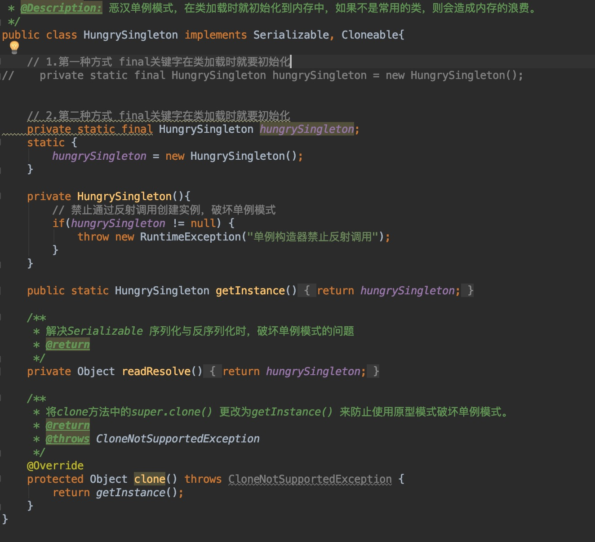
    2. 基于枚举类型实现类的单例模式（推荐使用）
    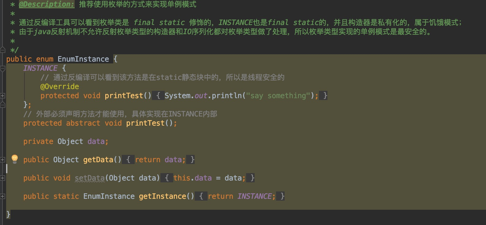
  * 其他解决单列模式的方案
    1. 容器单例(不考虑序列化/反序列化、反射的场景，推荐使用)
    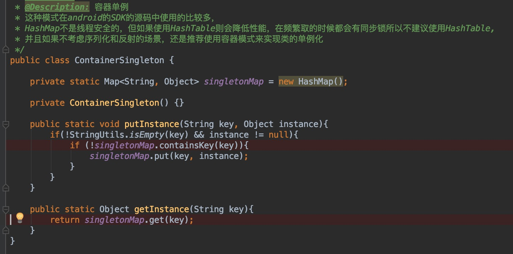
    2. 基于ThreadLocal实现的"单例"模式
    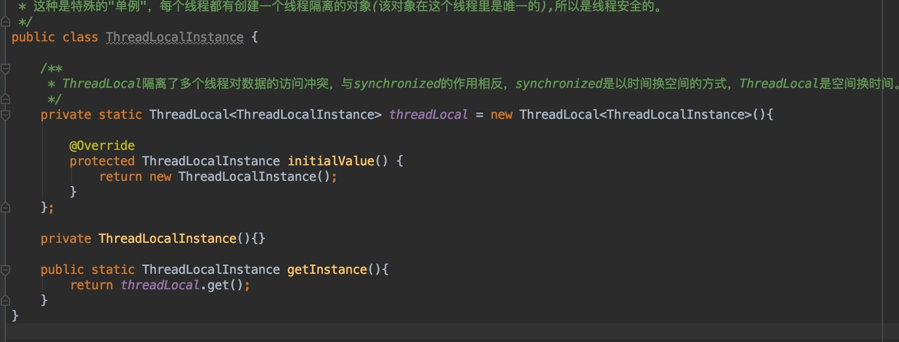
* 对单例模式的破坏：
  * 序列化/反序列化
  * 反射
  * 和原型模式同时使用时

**通过反编译工具可以查看jvm对class文件编译后的代码，有助于理解。java反编译工具[JAD](https://varaneckas.com/jad/)**

### 原型模式（prototype）
难度系数：3星

* 定义：指原型实例指定创建对象的种类，并且通过拷贝这些原型创建新的对象
* 不需要知道任何创建的细节，不调用构造函数
* 类型：创建型
* 适用场景：
  * 类初始化消耗过多资源
  * new 产生的一个对象需要非常繁琐的过程（数据准备、访问权限等）
  * 构造函数比较复杂
  * 循环体中生产大量对象时
* 优点：
  * 原型模式性能比直接new一个对象性能高
  * 简化创建过程
* 缺点：
  * 必须重写clone方法
  * 对复杂对象进行克隆时，容易引入风险，深拷贝和浅拷贝要运行得当 
* 扩展：
  * 深克隆
    1. 对对象中的引用对象，需要在clone方法中重新赋值（例：pig.birthday = (Date) pig.birthday.clone();）
    2. 和单例模式联合使用的情况下，会破坏单例模式。解决方法：在clone方法中重新调用getInstance()方法
  * 浅克隆

## Structural（结构型）

### 外观模式（facade，又叫门面模式）
难度系数：3星

* 定义：提供了一个统一的接口，用来访问子系统中的一群接口
* 外观模式定义了一个更高层的接口，让子系统更容易被使用
* 类型：结构型
* 适用场景：
  * 子系统越来越复杂，使用外观模式提供简单接口调用
  * 构建多层系统结构时，利用外观对象作为每层的入口，简化层间调用
* 优点：
  * 简化调用过程，无需了解深入子系统，防止带来风险
  * 减少系统依赖，松散耦合
  * 更好的划分访问层次
  * 符合迪米特法则，即最少知道原则
* 缺点：
  * 增加子系统、扩展子系统行为容易引入风险
  * 不符合开闭原则
* 相关设计模式
  * 外观模式和中介者模式
  * 外观模式和单例模式：通常把外观类做成单例模式，结合使用
  * 外观模式和抽象工厂模式：外观类可以通过抽象工厂获取子系统的实例
* UML
  

### 装饰器模式（decorator）
难度系数：4星

* 定义：在不改变原有对象的基础之上，将功能附加到对象上
* 提供了比继承更有弹性的替代方案（扩展原有对象的功能）
* 类型：结构型
* 适用场景：
  * 扩展一个类的功能或给一个类添加附加职责
  * 动态的给一个对象添加功能，这些功能可以再动态的撤销
* 优点：
  * 继承的有力补充，比继承灵活，不改变原有对象的情况下给一个对象扩展功能
  * 通过使用不同装饰类以及这些装饰类的排列组合，可以实现不同的效果
  * 符合开闭原则
* 缺点：
  * 会出现更多的代码，更多的类，增加程序复杂性
  * 动态装饰时，多层装饰时会更复杂
* 相关设计模式
  * 装饰者模式和代理模式：
  * 装饰者模式和适配器模式：都可以被叫做包装模式，装饰者和被装饰者都可以实现相同的接口，或者装饰者是被装饰者的子类；在适配器中，适配器类和被适配的类具有不同的接口，也可能有部分接口是重合的
* UML
  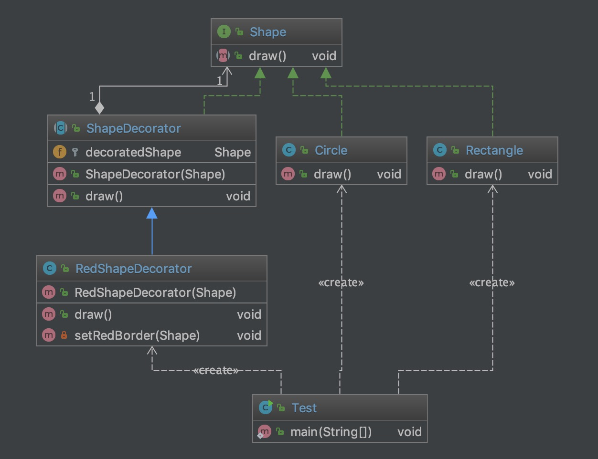
* 相关源码：
  * JDK：BufferedReader装饰Reader;BufferedInputStream继承FilterInputStream装饰InputStream
  * spring：SessionRepositoryRequestWrapper继承HttpServletRequestWrapper装饰了HttpServletRequest,ServletRequest
  * mybatis：Cache的装饰类BlockingCache,ScheduledCache,FifoCache

### 适配器模式（adapter）
难度系数：五星

* 定义：作为两个不兼容的接口之间的桥梁，将一个类的接口（被适配者）转换成客户希望的另一个接口（适配者）；使原本由于接口不兼容而不能一起工作的哪些类可以一起工作。
* 主要解决在软件系统中，常常要将一些“现存的对象”放入到新的环境中，而新环境要求的接口是现对象不能满足的。
* 类型：结构型
* 适用场景：
  * 已存在的类，它的方法和需求不匹配时（方法结果相同或相似）
  * 通过接口转换，将一个类插入到另一个类中（比如老虎和飞禽，现在多了一个飞虎，在不增加实体的需求下，增加一个适配器，在里面包容一个虎对象，实现飞的接口）
  * 不是软件设计阶段考虑的设计模式，是随着软件维护，由于不同的产品，不同厂家造成类的功能类似而接口不相同的情况下的解决方案
* 优点：
  * 能提高类的透明性和复用，现有的类复用而不用改变
  * 目标类和适配器类解耦，提高程序扩展性
  * 符合开闭原则
* 缺点：
  * 适配器编写过程需要全面考虑，大量使用会增加系统的复杂性
  * 增加系统代码可读难度（比如代码中明明看到调用的是A接口，其实内部被适配成了B接口的实现，一个系统如果太多出现这种情况，无疑是一种灾难）
* 扩展：
  * 对象适配器：符合组合复用原则，并且使用委托机制
  * 类适配器：通过类继承实现
* 相关的设计模式
  * 适配器模式和外观模式：都可以成为适配模式，但力度不同，外观模式是用来适配整个子系统，力度更大。
* UML
  * 类适配器
  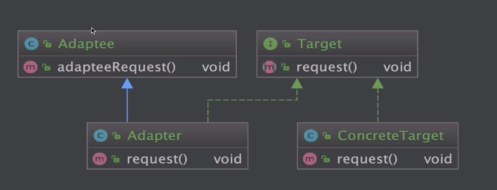
  * 对象适配器
  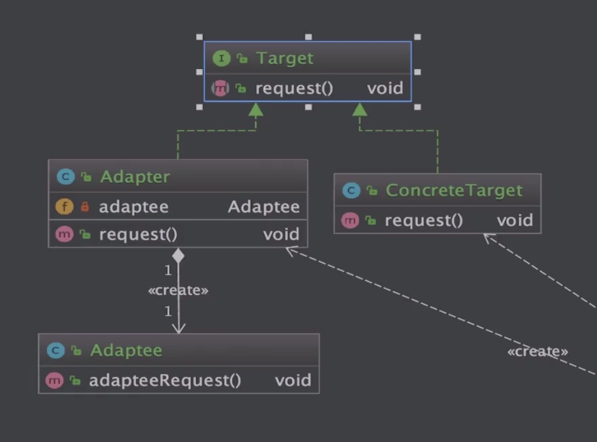
* 相关源码：
  * JDK：XmlAdapter 如果我们想解析时间类型，可以写个类继承XmlAdapter，实现序列化和反序列化的方法。
  * spring：AdvisorAdaptor接口，实现类MethodBeforeAdviceAdaptor
  * springmvc：HandlerAdaptor的使用。DispatcherServlet中通过处理映射器hanlderMapper找到对应的Handler控制器；HandlerAdaptor所处理的问题是为每个不同类型的contorller做适配，譬如RequestMappingHandlerAdapter是对应处理我们自定义的控制器请求

### 代理模式

### 享元模式（flyweight）

* 定义：用于减少创建对象的数量，以减少内存占用和提高性能，提供了减少对象数量从而改善应用所需的对象结构的方式；重用现有的同类对象，如果未找到匹配的对象，则创建新对象。
* 运用共享技术有效地支持大量细粒度的对象
* 类型：结构型
* 适用场景：
  * 系统有大量的相似对象
  * 需要缓冲池的场景
* 优点：
  * 减少对象的创建，降低系统的内存，使效率提高
  * 减少内存之外的其他资源占用（譬如文件句柄）
* 缺点：
  * 关注内/外部状态、关注线程安全问题
  * 是系统的逻辑复杂化
* 扩展：
  * 内部状态
  * 外部状态
* 相关设计模式：
  * 享元模式和代理模式
  * 享元模式和单例模式
* UML：
  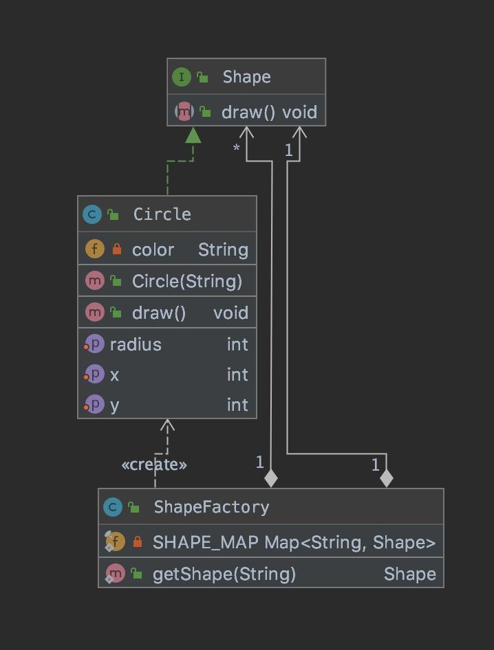
* 相关源码：
  * JDK：Integer类中的IntegerCache静态内部类,在valueOf()方法中，判断数值是否大于127小于-128,如果在这个区间则从IntegerCache中获取。
  * apache common包中的GenericKeyedObjectPool连接池

### 组合模式（composite）

* 定义：将对象组合成树形结构以表示“部分-整体”的层次结构
* 组合模式使客户端对单个对象和组合对象保持一致的处理方式
* 类型：结构型
* 适用场景：
  * 希望客户端可以忽略组合对象与单个对象的差异时
  * 处理一个树形结构时
* 优点：
  * 清楚定义分层次的复杂对象，表示对象的全部或部分层次
  * 让客户端忽略层次的差异，方便对整个层次结构进行控制
  * 简化客户端代码
  * 符合开闭原则
* 缺点：
  * 限制类型时会比较复杂
  * 使设计变得更加抽象
* 相关的设计模式：
  * 组合模式和访问者模式

## Behavioral

