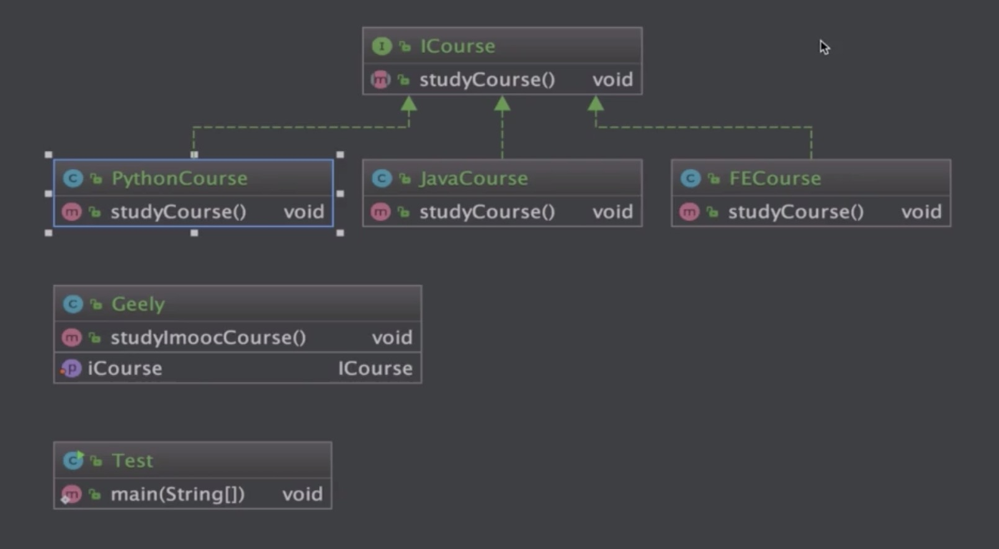

# 软件设计的七大原则

## 开闭原则
最重要的原则，其他原则的基础；面向抽象编程

 * 定义：一个软件实体如类、模块和函数应该对扩展开放，对修改关闭
 * 用抽象定义框架，用实现扩展细节
 * 优点：提高软件系统的可复用性及可维护性

## 依赖倒置原则

 * 定义：高层模块不应该依赖低层模块，二者都应该依赖其抽象
 * 抽象不应该依赖细节；细节应该依赖抽象
 * 针对接口编程；不要针对实现编程
 * 优点：可以减少类间的耦合性、提高系统稳定性，提高代码可读性和可维护性，可降低修改程序所造成的风险
  
  

## 单一职责原则

 * 定义：不要存在多于一个导致类变更的原因
 * 一个类/接口/方法只负责一项职责
 * 优点：降低类的复杂度、提高类的可读性，提高系统的可维护性、降低变更引起的风险。

## 接口隔离原则

 * 定义：用多个专门的接口，而不使用单一的总接口，客户端不应该依赖它不需要的接口
 * 一个类对一个类的依赖应该建立在最小的接口上
 * 建立单一接口，不要建立庞大臃肿的接口
 * 尽量细化接口，接口中的方法尽量少
 * 注意适度原则，一定要适度
 * 优点：符合常说的高内聚低耦合的设计思想，从而使的类有很好的可读性、可扩展性和可维护性

## 迪米特法则（最少知道原则）

 * 定义：一个对象应该对其他对象保持最少的了解。又叫最少知道原则
 * 尽量降低类与类之间的耦合
 * 优点：降低类之间的耦合
 * 强调只和朋友交流，不和陌生人说话
 * 朋友：出现在成员变量、方法的输入、输出参数中的类称为成员朋友类，而出现在方法体内部的类不属于朋友类

## 里氏替换原则

 * 引申意义：子类可以扩展父类的功能，但不能改变父类原有的功能。
 * 含义1：子类可以实现父类的抽象方法，但不能覆盖父类的非抽象方法。
 * 含义2：子类中可以增加自己特有的方法。
 * 含义3：当子类的方法重载父类的方法时，方法的前置条件（即方法的输入/入参）要比父类方法的输入参数更宽松。
 * 含义4：当子类的方法实现父类的方法时（重写/重载或实现抽象方法），方法的后置条件（即方法的输出/返回值）要比父类更严格或相等。
 * 优点1：约束继承泛滥，开闭原则的一种体现。
 * 优点2：加强程序的健壮性，同时变更时也可以做到非常好的兼容性，提高程序的维护性、可扩展性。降低需求变更时引入的风险。

## 合成/复用原则（组合/复用原则）

 * 定义：尽量使用对象组合/聚合，而不是继承关系达到软件复用的目的。
 * 聚合has-A和组合contains-A。
 * 优点：可以使系统更加灵活，降低类与类之间的耦合度，一个类的变化对其他类造成的影响相对较小。

# 设计模式

## Creational (创造型)

### 简单工厂模式

### 工厂方法模式

* 定义：定义一个创建对象的接口，但让实现这个接口的类来决定实例化哪个类，工厂方法让类的实例化推迟到子类中进行。
* 类型：创建型
* 适用场景：
    * 创建对象需要大量的重复代码。
    * 应用层代码不依赖产品类实例如何被创建、实现等细节。
    * 一个类通过其子类来指定创建哪个对象。
* 优点：
    * 用户只需要关心所需穿品对应的工厂，无须关心创建细节
    * 加入新产品符合开闭原则，提高可扩展性
* 缺点：
    * 类的个数容易过多，增加复杂度
    * 增加了系统的抽象性和理解难度
    

## Structural 

## Behavioral

# design_pattern
# design_pattern
